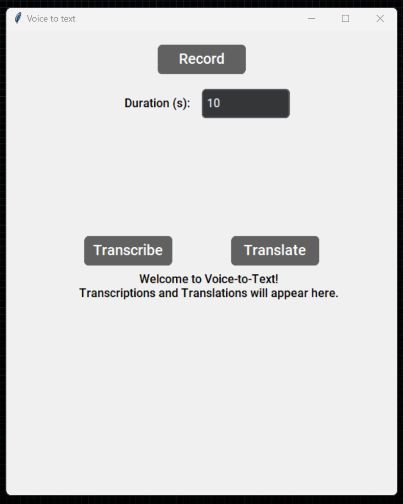
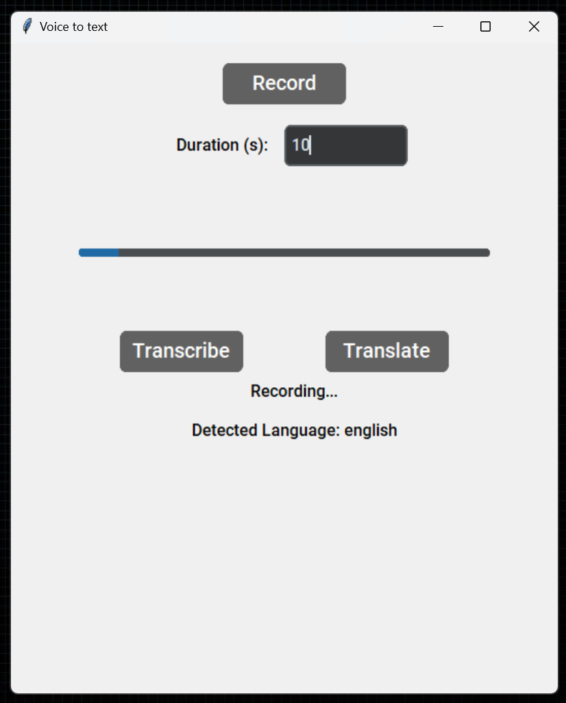
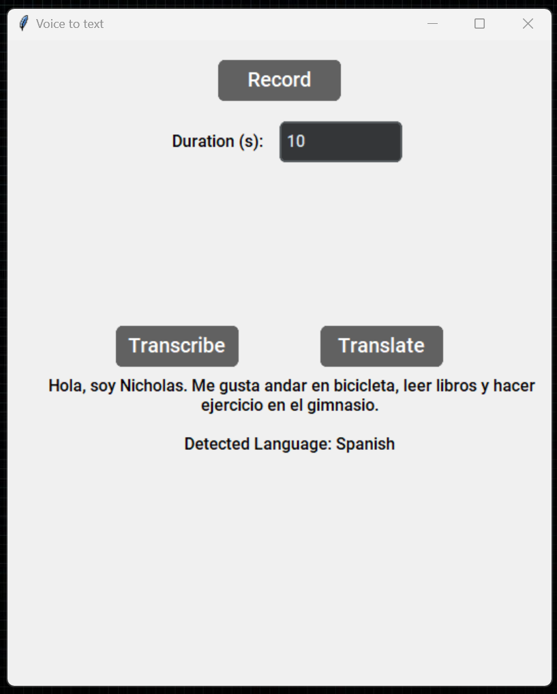
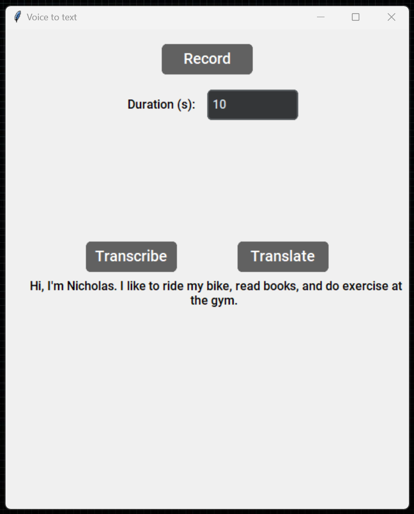

Here's the updated README with the `ffmpeg` requirement added:

---

# Voice-to-Text App

A simple Voice-to-Text application using Python, Tkinter, and OpenAI's Whisper model to record audio, transcribe spoken words into text, and translate them if needed.

## Features

- **Record Audio**: Records audio for a specified duration.
- **Transcribe Audio**: Converts recorded audio into text.
- **Translate Audio**: Translates the transcribed text into English.

## Requirements

This app requires the following libraries and tools:
- `tkinter` (for GUI)
- `customtkinter` (for enhanced UI components)
- `soundfile` and `sounddevice` (for audio recording and saving)
- `openai-whisper` (for transcription and translation)
- **FFmpeg** (for handling audio formats required by Whisper)

You can install the required Python packages using:
```bash
pip install tkinter customtkinter soundfile sounddevice openai-whisper
```

### FFmpeg Installation

FFmpeg is needed by Whisper to process audio files. Follow the instructions for your OS:

- **Windows**: [Download FFmpeg](https://ffmpeg.org/download.html) and add it to your PATH.
- **MacOS**: Install using Homebrew:
  ```bash
  brew install ffmpeg
  ```
- **Linux**: Install via your package manager (e.g., `apt` for Debian-based systems):
  ```bash
  sudo apt update
  sudo apt install ffmpeg
  ```

## Setup

1. Clone or download this repository.
2. Ensure all requirements are installed, including FFmpeg.
3. Run the program by executing the following command:
   ```bash
   python app.py
   ```

## Usage

1. **Set Duration**: Enter the recording duration (in seconds) in the input field.
2. **Record**: Click on the "Record" button to start recording. A progress bar will indicate the recording status.
3. **Transcribe**: Once recording is complete, click on "Transcribe" to convert audio to text.
4. **Translate**: To translate the transcribed text to English, click on the "Translate" button.

## Code Overview

- **Constants**: Define application width, height, and default values.
- **App Functions**:
  - `record()`: Records audio based on the specified duration and saves it as `my_audio.flac`.
  - `transcribe()`: Transcribes the recorded audio into text.
  - `translate()`: Translates the transcribed text into English.
- **UI Elements**: CustomTkinter components for layout, labels, buttons, and input fields.
- **Main Loop**: Launches the application window.

## Screenshots

- **Base App**:


- **Recording in Progress**:


- **Transcription Results**:


- **Translation Results**:


## License

This project is open-source and available for use and modification under the MIT License.

## Contributing

Feel free to open issues or submit pull requests to improve functionality or add new features.
